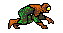

## Who is Tuteque-man? 

> **Welcome to the digital headquarters of Tuteque-man, the formidable force of backend justice.**  
> A developer with technical skills as sharp as a code-forged katana.  
> My mission: to build **secure**, **scalable**, and **well-documented** systems, fighting tech chaos one line at a time.

---

## TECHNICAL SKILLS

<table>
<tr>
<td width="50%">
  
</td>
<td width="50%">
  
</td>
</tr>
</table>

| **Language/Stack** | **Description** |
|--------------------|-----------------|
| Python             | Automation, analysis, and elegant development |
| Java               | Robustness and enterprise power |
| JavaScript         | The engine of web development |
| Node.js            | Real-time APIs and applications |
| HTML + CSS         | Visual structure and style |
| PHP                | Custom backend logic |
| Vue.js             | Dynamic and agile frontend |
| SQL                | Data management and protection |

---

## KNOWN TECHNOLOGIES

**AI Tools:** ChatGPT, GitHub Copilot, Gemini  
**Code Editors:** VSCode, Cursor, JetBrains IDEs

---

## CURRENT MISSION

> **Improve data validation**  
> **Elevate API documentation**  
> **Strengthen the Tuteque-man brand as a freelance symbol of excellence**

---

## FEATURED REPOSITORIES

| **Repository**         | **Purpose**                        | **Status**      |
|------------------------|------------------------------------|-----------------|
| validador-multiforme   | Adaptable validation framework      | In progress     |
| jwt-tactico            | Ultra-secure authentication system  | In production   |
| docupoder              | Professional documentation template | In testing      |

---

## NEXT GOALS

> **Master statistical and advanced analysis**  
> **Create a personal API design framework**  
> **Expand the Tuteque-man brand across the tech multiverse**

---

## CONTACT

> Looking for a reliable developer for your project?  
> - [GitHub](https://github.com/Tuteque-man)  
> - Available for freelance projects, code reviews, and professional collaborations

---

> **"Your attitude compiles your destiny."**  
> – Tuteque-man
