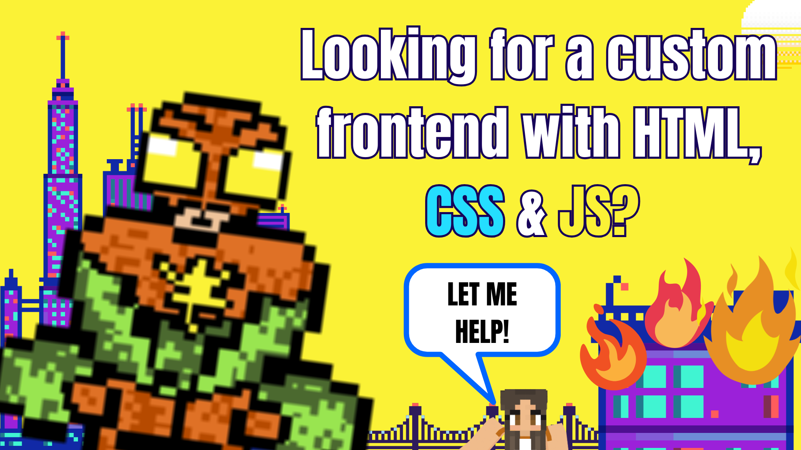
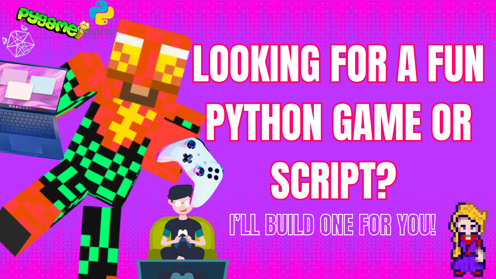
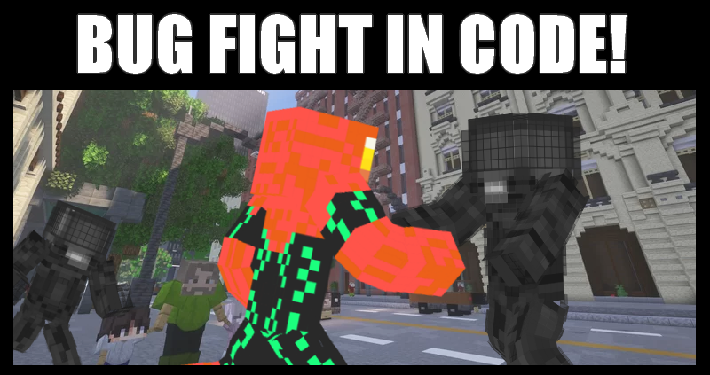
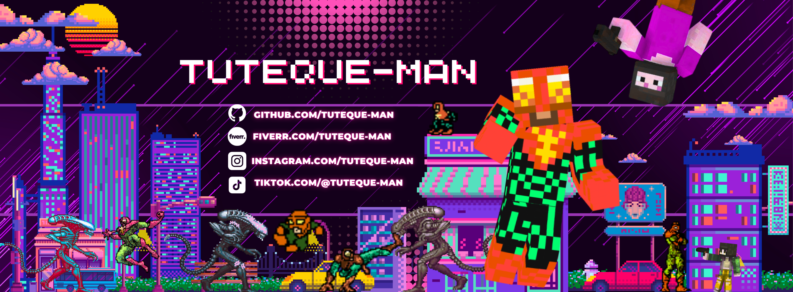

<!-- GitHub News Style — Tech Herald Special Edition -->
<h1 style="font-size:100px; color:#ff3366; text-shadow: 3px 3px #222;">WHO IS TUTEQUE-MAN? HERO OR DEVELOPER?</h1>

  

In a world where code rules and security is the final frontier, a formidable figure rises: Tuteque-man. Armed with technical skills as sharp as a katana forged from code, this developer has become a symbol of backend justice.

His mission is clear: build secure, scalable, and well-documented systems, battling digital chaos line by line.

> [!TIP]
> Want freelance clients to trust you faster? Pin a “Tech Herald” profile on your README. Identity builds reliability.

<h2>Core Skills</h2>

<ul>
  <li>Python: Automation, analysis, and elegant development</li>
  <li>Java: Enterprise-grade robustness</li>
  <li>JavaScript: The engine of modern web development</li>
  <li>Node.js: Real-time applications and APIs</li>
  <li>HTML + CSS: Visual structure and styling</li>
  <li>PHP: Custom backend logic</li>
  <li>Vue.js: Agile and reactive frontends</li>
  <li>SQL: Data management and protection</li>
</ul>

<h2>Featured Gecko-Technologies</h2>

  

<h2>Technologies that I should learn</h2>

  

AI Tools: ChatGPT, GitHub Copilot, Gemini 
Code Editors: VSCode, Cursor, JetBrains IDEs

<h2>Current Mission</h2>

<ul>
  <li>Improve data validation</li>
  <li>Enhance API documentation</li>
  <li>Elevate the Tuteque-man brand as a freelance symbol of excellence</li>
</ul>

<h2>GitHub Metrics</h2>

  
  

> [!CAUTION]
> Overwriting production with untested updates is like swinging through the city without a web — risky and loud when it crashes.
 
<h1> MORE HOUSEKEEPER FIVERR GIGS! </h1>

  
  
  

<h2>Featured Tuteque-Projects</h2>

<ul>
  <li><strong>validador-multiforme:</strong> Adaptable validation framework (in progress)</li>
  <li><strong>jwt-tactico:</strong> Ultra-secure authentication system (in production)</li>
  <li><strong>docupoder:</strong> Professional documentation template (in testing)</li>
</ul>

> [!WARNING]
> Don't deploy without validating inputs. Even the most heroic code can fall to silent bugs if left unchecked.

<h2>Upcoming Tuteque-Goals</h2>

<ul>
  <li>Master advanced statistical analysis</li>
  <li>Build a personal API design framework</li>
  <li>Expand the Tuteque-man brand across the tech multiverse</li>
</ul>

> [!IMPORTANT]
> Tuteque-man's core logic is the backbone of backend justice. Never compromise on architecture — it defines destiny.

<h2>You already know how to find this tuteque.</h2>

<h3 style="font-weight:400; font-style:italic; color:#777;">
  You already know how to find this tuteque.  
  Some follow GPS coordinates. Others read the stars. But those who know the rhythm of good code and the scent of great branding... they simply feel when Tuteque is near.  
  It’s not just a name. It’s a signal. A resonance that echoes through well-crafted interfaces and Firebase-hosted brilliance. Whether it’s a sleek inventory system or a sarcastic superhero built in HTML, his work speaks — fluently, functionally, and fearlessly.  
  There’s no need for a map. Just click, and the legend unfolds.
</h3>

>[!NOTE]
>"Your attitude compiles your destiny." – Tuteque-man

  

